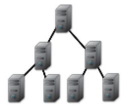
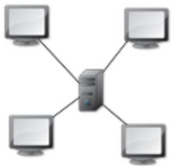
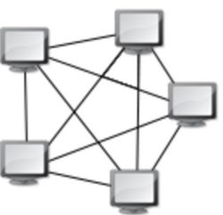

## Les bases du réseau

### Qu’est-ce qu’un réseau ?

un **réseau** désigne un ensemble interconnecté d'équipements et de leurs relations
autorisant la circulation en continu ou discontinue.

### Les différents types de réseaux :

- Réseau en anneau
- Réseau en arbre
- Réseau en bus
- Réseau en étoile
- Réseau maillé

### I. Réseau en anneau :

On dit d'un réseau que sa topologie est en anneau, lorsque toutes les stations, ou equipements, sont connectés en chaine 
les un aux autres par une liaison bipoint de la dernière à la première La défaillance d’un hôte rompt la chaîne.

 

### II. Réseau en arbre : 

On parle aussi de réseau hiérarchique, car l’architecture est divisée en niveaux. Le sommet représente la racine
ou le sommet et est connecté à plusieurs nœuds du niveau inférieur. Ces nœuds peuvent également être connectés à un ou plusieurs nœuds du niveau inférieur…
Là encore, si le père des équipements (le sommet de l’arbre), vient à défaillir, cela interdit toute communication avec ses subordonnés.

### III. Réseau en bus :

Le câblage ici s’effectue via une liaison unique des unités. 
Cela représente un faible coût de déploiement et la défaillance d’un nœud, n’empêche pas les autres de fonctionner. Les équipements peuvent être reliés de façon passive par dérivation électrique ou optique. Le point faible, dans ce cas, est le support (ou média) de transfert. 
Lorsque celui-ci tombe en panne, c’est tout le réseau qui s’arrête.

### IV. Réseau en étoile :

Ce genre d’architecture est également appelé hub & spoke. C’est la topologie la plus courante. 
Elle permet une gestion et un dépannage très facile. La panne d’un nœud ne perturbe absolument par le réseau global. En revanche, le concentrateur (aussi appelé hub ou plus fréquemment appelé commutateur), qui relie tous les nœuds entre eux, constitue un point unique de défaillance. Une panne de cet équipement rend le réseau totalement inutilisable. Le réseau Ethernet est un très bon exemple de réseau en étoile. 
Il faut toujours veiller, par contre à la longueur des câbles utilisés.

### V. Réseau maillé :

Cela correspond à plusieurs liaisons point à point où chaque unité est reliée à N-1 point permettant ainsi de la mettre en relation avec l’ensemble des autres équipements. 
L’inconvénient de cette architecture est le nombre de liaisons nécessaires qui croient lorsque le nombre de points augmente : pour N terminaux, il faut N x (N-1) / 2 liaisons.
Ce genre de topologie se rencontre dans les grands réseaux de distribution, comme Internet.

